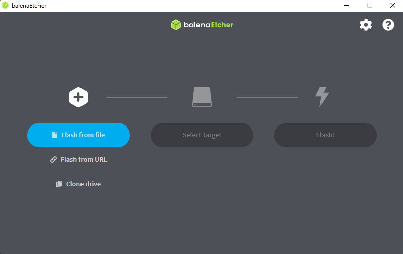

# Flashing with other tools
## balenaEtcher
No, this isn´t sponsored. I just really like this tool for some general purpose flashing.
 

balenaEtcher allows you to:
* Flash an OS to a SD card or an USB
* Doesn´t require admin access
* Super Speedy with flashing

balenaEtcher cons:  
I did not find any cons about balenaEtcher.

## Steps to flash with balenaEtcher
Download balenaEtcher: https://www.balena.io/etcher/

Open it and select what do you want to do. I suppose you want to flash from a file.  
Select the file and then select the target. balenaEtcher will try and guess what drive you want to use but ALWAYS double check if the drive is the correct one because clicking the Flash! button will erase it completely. Once ready press the Flash! button and just wait.  
After it is done, just unplug the drive and connect it to your Raspberry Pi.

That´s it!  
**Also check out: List of OSes you might wanna try.md**
# If you found this useful. Please give this a star or share it with your friends.