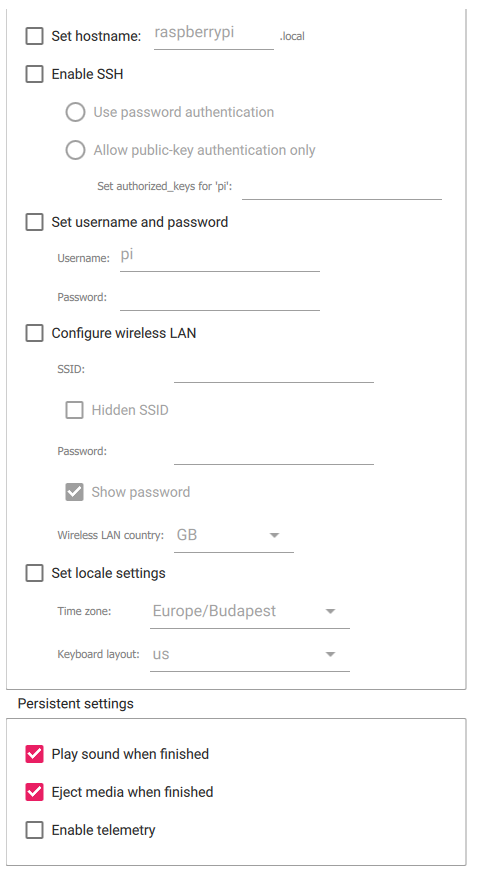

# Using the official tool by Raspberry Pi foundation
## Raspberry Pi Imager
This is a simple guide to installing, flashing and running and OS with Raspberry Pi imager. (Yes I typed this at 3AM don´t mind my grammar. Enjoy)
 

Raspberry Pi Imager allows you to:
* Flash an OS to a SD card or an USB
* Flash the EEPROM for the Raspberry Pi
* Additionally this tool runs if there is no OS located on the SD card or USB (Requires Ethernet and an updated EEPROM)
* Allows you to configure some settings before flashing
##### Now this all may seem beautiful but RPi Imager also has some drawbacks.

Raspberry Pi Imager cons:
* Sometimes slows down overtime
* Can freeze randomly
(This happens on other flashers too but is more common on the RPi Imager)

## Steps to flash with Raspberry Pi Imager
Install RPi Imager. 
https://www.raspberrypi.com/software/ 

WARNING! Anything stored on the target drive will get erased.  

After installing click the "Choose OS" button and select the OS of your choice.  
Next, select the SD card or USB that you want to use. I don´t recommend using an NTFS drive cause it is just does not make sense to boot a Raspberry Pi with am NTFS drive  
If you selected an official Raspberry Pi OS (Raspbian) a small gear will show up in the bottom right of the window. You can configure some of the stuff that will be already set up on the OS. (Scroll down past the table if you don´t care about this.)

  

## Here´s an explanation for each option.
| Option  |  Explanation  |
|     :---:      |     :---:      |
| Set hostname | Sets the hostname of the Pi (eg. `user@HOSTNAME`) |
| Enable SSH  | Just enables SSH connections to the Pi. (After enabling you will have to set the password in the "Use password authentication" field or add a public key to the "Allow public-key authentication only" field)  |
| Set username and password  | This one is obvious. Set the password or username before even booting the Pi  |
| Configure wireless LAN  | If you don´t have a RJ-45 cable (ethernet) lying around, you can take advantage of the built in WiFi chip on the RPi. If you PC is connected to a WiFi network, It´s credentials will get filled in automatically. (SSID = Name of the network) |
| Set locale settings  | If you wanna sync your time and date automatically, I highly recommend you turn this on and set it to your continent/city. The keyboard layout is simple. Just type in the short for your country and enjoy not having the hassle to learn the US keyboard layout (Unless you are from US)  |
| Play sound when finished  | On windows: Plays the warn sound when the flashing is complete  |
| Eject media when finished  | Eject the SD card or USB when finished flashing  |
| Enable telemetry  | I recommend turning this off since it sends statistics to Raspberry Pi fundation and if you are a more anonymous user you will hate turning this on.  |

# After all configuration. Just click "WRITE"
After everything is done. You can close RPi Imager and put the SD card or USB into your Pi. Enjoy!

**Also check out: List of OSes you might wanna try.md**
# If you found this useful. Please give this a star or share it with your friends.